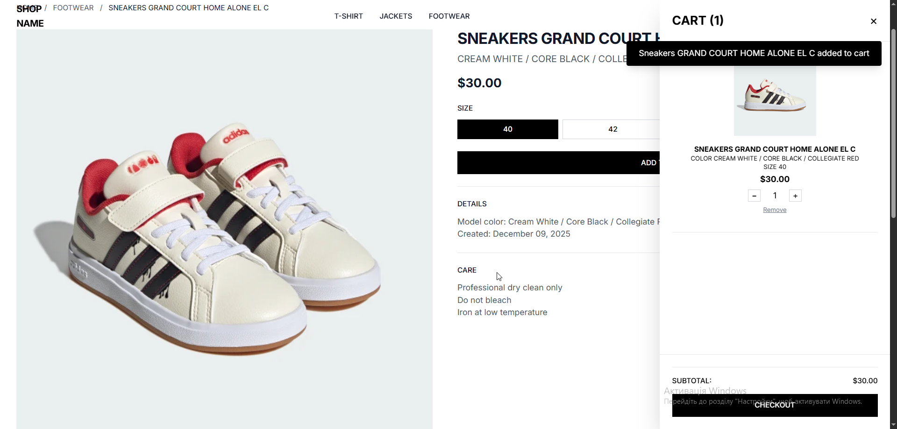

# Django Shop

**Django Shop** — це повністю динамічно орієнтований онлайн-магазин одягу з сучасними функціями для користувачів та адміністратора.

---

## Основні можливості

- **Каталог товарів** з динамічною фільтрацією та сортуванням.
- **Користувацька модель** з реєстрацією, профілем та історією замовлень.
- **Динамічна корзина** з оновленням кількості товарів в реальному часі.
- **Відгуки користувачів** з аналізом настрою за допомогою штучного інтелекту.
- **Сортування товарів** за "прихованим рейтингом", що враховує:
  - Перегляди товару
  - Додавання в корзину
  - Оцінки користувачів
  - AI Sentiment Score
- **Інтеграція Stripe** для зручної оплати замовлень.
- Повна адміністративна панель для керування товарами, категоріями та замовленнями.

---

## Технічні деталі

- **Django 5**
- **HTMX** для динамічної підвантаження контенту без перезавантаження сторінки
- **TailwindCSS** для адаптивного дизайну
- **Alpine.js** для інтерактивності фронтенду
- **SQLite / PostgreSQL** (можна налаштувати за бажанням)
- **Stripe API** для платежів

